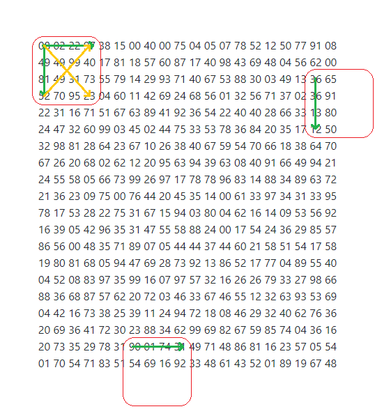

## 11. Largest product in a grid

주어진 20 &times; 20 그리드를 배열 등 **인덱스로 접근할 수 있는** 구조에 저장한 후, 그리드 내 모든 숫자에 대해 다음 과정을 반복한다.

1. 반복의 기준이 되는 숫자를 첫 번째 원소로 갖는 가상의 4 &times; 4 그리드를 생각한다. 이 4 &times; 4 그리드는 주어진 20 &times; 20 그리드를 벗어날 수 **있다**.
2. 4 &times; 4 그리드의 1행, 1열, 그리고 두 대각선에 대해서 각각, 숫자가 네 개 존재한다면 곱을 구하고 최대값을 경신한다. (아래 이미지 참고)

  

