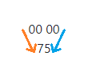
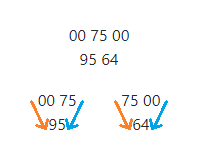
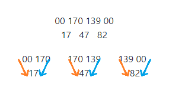

## 18. Maximum path sum I

삼각형의 한 숫자에서 아래줄의 인접한 숫자로 내려가는 방법은 두 가지다. 
이것을 아래줄 입장에서 보면, 바로 윗줄에서 한 숫자로 내려오는 방법이 두 가지인 것으로 생각할 수도 있다.

따라서 삼각형의 각 숫자에 대해, 해당 숫자로 내려올 수 있는 두 가지 경로 중 합이 더 큰 경로를 선택하고 해당 숫자를 더한다. 
그러면 꼭대기에서 시작하여 해당 숫자까지 내려올 수 있는 경로 중, 합이 최대가 되는 경로는 유일하게 정해진다.

이 과정을 꼭대기부터 시작하여 마지막 줄까지 반복한다.

  

첫 번째 줄에는 윗줄이 없으므로 0이 존재한다고 가정하고, 첫 번째 줄의 숫자(=75)로 내려올 수 있는 두 가지 경로(왼쪽 0에 75를 더하는 경로와 오른쪽 0에 75를 더하는 경로) 중 합이 더 큰 경로를 선택한다.

  

두 번째 줄부터는 윗줄에서 내려오는 경로를 생각할 수 있는데, 그 중 첫 번째 숫자(=95)와 마지막 숫자(=64)는 한 방향의 경로만 존재한다. 경로가 없는 방향에는 0을 놓고 계산하면 된다. 
95의 입장에서 보면 0보다 75가 크기 때문에 75에 95를 더하는 경로를 택할 것이고, 64의 입장에서 봐도 75가 0보다 크기 때문에 75에 64를 더하는 경로를 택할 것이다.

  

세 번째 줄도 같은 방법을 사용해보면, 17은 170(=75+95)과 더해지고, 47도 170(=75+95)과 더해지고, 82는 139(=75+64)와 더해진다.

위와 같은 방법으로 마지막 줄까지 반복하면, 마지막 줄의 숫자 개수(=15개)만큼의 경로 합이 존재하므로, 그 중에서 가장 큰 값을 찾는 일은 어렵지 않다.
