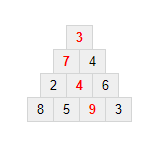
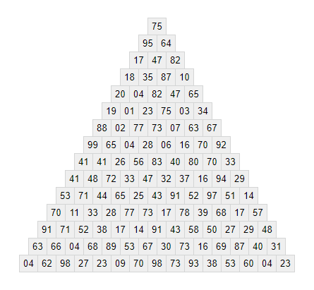

## 18. Maximum path sum I

다음 삼각형에서, 꼭대기에서 시작하여 아래줄의 인접한 숫자를 거쳐 내려간다고 할 때, 각 경로 위의 숫자들의 합 중 최대값은 23이다.

  3</strong> 
<strong>7</strong> 4 
2 <strong>4</strong> 6 
8 5 <strong>9</strong> 3"
  >

즉, 3 + 7 + 4 + 9 = 23 이다.

다음 삼각형에서, 위와 같은 방법으로 얻을 수 있는 **경로 위의 숫자들의 합** 중 최대값을 구하여라.

  
95 64 
17 47 82 
18 35 87 10 
20 04 82 47 65 
19 01 23 75 03 34 
88 02 77 73 07 63 67 
99 65 04 28 06 16 70 92 
41 41 26 56 83 40 80 70 33 
41 48 72 33 47 32 37 16 94 29 
53 71 44 65 25 43 91 52 97 51 14 
70 11 33 28 77 73 17 78 39 68 17 57 
91 71 52 38 17 14 91 43 58 50 27 29 48 
63 66 04 68 89 53 67 30 73 16 69 87 40 31 
04 62 98 27 23 09 70 98 73 93 38 53 60 04 23"
  >

**참고**: 위 삼각형에는 경로가 16384 가지 밖에 없으므로, 모든 경로를 조사해도 문제를 풀 수 있다. 하지만, (100줄 짜리 삼각형에 대해 이 문제와 같은 요구를 하는) [67번 문제](/problems_051to075/problem_067)는 모든 경로를 조사해서 푸는 것이 불가능하므로, 효율적인 방법을 찾아야 할 것이다. :wink:
