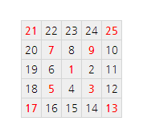

## 28. Number spiral diagonals

### Translation
* [한국어](./translation-ko.md)

Starting with the number 1 and moving to the right in a clockwise direction a 5 by 5 spiral is formed as follows:

  21</strong> 22 23 24 <strong>25</strong> 
20 <strong>7</strong> 8 <strong>9</strong> 10 
19 6 <strong>1</strong> 2 11 
18 <strong>5</strong> 4 <strong>3</strong> 12 
<strong>17</strong> 16 15 14 <strong>13</strong>"
  >

It can be verified that the sum of the numbers on the diagonals is 101.

What is the sum of the numbers on the diagonals in a 1001 by 1001 spiral formed in the same way?
