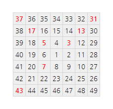

## 58. Spiral primes

1부터 시작해서 다음과 같이 반시계방향으로 돌아 나오면, 길이 7짜리 정사각형 소용돌이가 만들어진다.

  37</strong> 36 35 34 33 32 <strong>31</strong> 
38 <strong>17</strong> 16 15 14 <strong>13</strong> 30 
39 18 <strong>5</strong> 4 <strong>3</strong> 12 29 
40 19 6 1 2 11 28 
41 20 <strong>7</strong> 8 9 10 27 
42 21 22 23 24 25 26 
<strong>43</strong> 44 45 46 47 48 49"
  >

한 가지 흥미로운 점은, 홀수 제곱수들이 오른쪽 아래방향 대각선상에 있다는 것이다. 하지만 더 흥미로운 점은, 두 대각선상에 있는 열 세 개 수 중 여덟 개, 약 62%(&ap; 8/13)가 소수라는 것이다.

위 소용돌이에서 한 바퀴 더 감싸면, 길이 9짜리 정사각형 소용돌이가 만들어질 것이다. 이 과정을 계속했을 때, 두 대각선상의 소수 비율이 10% 아래로 떨어지는 가장 작은 정사각형 소용돌이의 길이를 구하여라.
