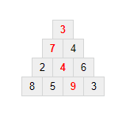

## 67. Maximum path sum II

다음 삼각형에서, 꼭대기에서 시작하여 아래줄의 인접한 숫자를 거쳐 내려간다고 할 때, 각 경로 위의 숫자들의 합 중 최대값은 23이다.

  3</strong> 
<strong>7</strong> 4 
2 <strong>4</strong> 6 
8 5 <strong>9</strong> 3"
  >

즉, 3 + 7 + 4 + 9 = 23 이다.

100줄 짜리 삼각형이 들어있는 15K 텍스트 파일인 [triangle.txt](./triangle.txt)를 사용하여, 위와 같은 방법으로 얻을 수 있는 **경로 위의 숫자들의 합** 중 최대값을 구하여라.

참고: 이것은 [18번 문제](/problems_001to025/problem_018)의 훨씬 더 어려운 버전이다. 총 299개 경로가 있기 때문에, 이 문제를 풀기 위해 모든 경로를 확인하는 것은 불가능하다. 만약 당신이 초당 1조(1012)개의 경로를 확인할 수 있더라도, 모든 경로를 확인하는 데 200억 년이 넘게 걸릴 것이다. 이것을 풀기 위한 효과적인 알고리즘은 존재한다. :wink:
