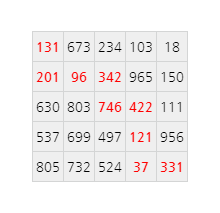

## 81. Path sum: two ways

In the 5 by 5 matrix below, the minimal path sum from the top left to the bottom right, by **only moving to the right and down**, is indicated in bold red and is equal to 2427.

  131</strong> 673 234 103 18 
<strong>201</strong> <strong>96</strong> <strong>342</strong> 965 150 
630 803 <strong>746</strong> <strong>422</strong> 111 
537 699 497 <strong>121</strong> 956 
805 732 524 <strong>37</strong> <strong>331</strong>"
  >

Find the minimal path sum from the top left to the bottom right by only moving right and down in [matrix.txt](./matrix.txt), a 31K text file containing an 80 by 80 matrix.
