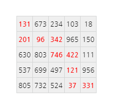

## 81. Path sum: two ways

다음 5 &times; 5 행렬에서, 왼쪽 위를 출발점으로 하고, **오른쪽 또는 아래로만 이동**해서, 오른쪽 아래를 도착점으로 하는 경로들 중, 합이 최소가 되는 경로는 다음과 같이 붉게 표시되어있고, 이 경로 위의 수를 합하면 2427이다.

  131</strong> 673 234 103 18 
<strong>201</strong> <strong>96</strong> <strong>342</strong> 965 150 
630 803 <strong>746</strong> <strong>422</strong> 111 
537 699 497 <strong>121</strong> 956 
805 732 524 <strong>37</strong> <strong>331</strong>"
  >

80 &times; 80 행렬이 들어있는 텍스트 파일 [matrix.txt](./matrix.txt)를 사용하여, 왼쪽 위를 출발점으로 하고, 오른쪽 또는 아래로만 이동해서, 오른쪽 아래를 도착점으로 하는 경로들 중, 합이 최소가 되는 경로에 놓인 수들의 합을 구하여라.
