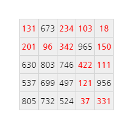

## 83. Path sum: four ways

NOTE: This problem is a significantly more challenging version of [Problem 81](/problems_076to100/problem_081).

In the 5 by 5 matrix below, the minimal path sum from the top left to the bottom right, by moving left, right, up, and down, is indicated in bold red and is equal to 2297.

  131</strong> 673 <strong>234</strong> <strong>103</strong> <strong>18</strong> 
<strong>201</strong> <strong>96</strong> <strong>342</strong> 965 <strong>150</strong> 
630 803 746 <strong>422</strong> <strong>111</strong> 
537 699 497 <strong>121</strong> 956 
805 732 524 <strong>37</strong> <strong>331</strong>"
  >

Find the minimal path sum from the top left to the bottom right by moving left, right, up, and down in [matrix.txt](./matrix.txt), a 31K text file containing an 80 by 80 matrix.
