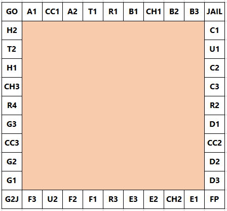

## 84. Monopoly odds

보드게임 <em>모노폴리</em>[^1]에서, 표준 보드는 다음과 같이 설정된다.

[^1]: 보드게임 부루마불의 원형이다.

  

각 플레이어는 GO 칸에서 시작하고, 정육면체 주사위 두 개를 던져서 나온 눈 개수의 합만큼 시계방향으로 이동한다. 이것이 규칙의 전부라면, 각 칸에 방문할 확률이 2.5%로 동일할 것이라 예상된다. 하지만, G2J (JAIL 칸으로 이동), CC (커뮤니티 상자), CH (찬스) 칸에 도착하면 확률 분포가 변경된다.

G2J 칸에 도착하는 것 뿐만 아니라, CC 칸이나 CH 칸에 도착했을 때 뽑는 카드 중에도 JAIL 칸으로 이동하는 카드가 있으며(CC 카드 중 한 장, CH 카드 중 한 장), 만약 플레이어가 한 차례에서 세 번 연속 더블[^2]을 던졌다면, 세 번째 더블은 무시하고 JAIL 칸으로 이동한다.

[^2]: 두 주사위를 던져서 같은 개수의 눈이 나왔을 때를 말한다. 눈 개수의 합만큼 이동한 후, 도착한 칸에 지침이 있다면 따르고, 그 결과, 플레이어의 위치가 JAIL 칸이 아니라면, 두 주사위를 한 번 더 던진다.

게임을 시작할 때, CC 카드와 CH 카드를 각각 섞는다. 플레이어가 CC 칸이나 CH 칸에 도착하면, 해당 카드 더미의 가장 위에 있는 카드를 가져가고, 그 카드의 지침을 따른 후, 가져왔던 더미의 가장 아래에 넣는다. 각 더미에는 열 여섯 장의 카드가 있지만, 이 문제의 목적을 위해 우리는 이동을 지시하는 카드에만 관심을 가질 것이다. 즉, 가져간 카드가 이동과 관련 없는 카드라면, 플레이어는 그 카드의 지침을 무시하고 도착했던 CC 칸(또는 CH 칸)에 남는다.

* 커뮤니티 상자 (2/16 cards):
  1. GO 칸으로 전진
  2. JAIL 칸으로 이동
* 찬스 (10/16 cards):
  1. GO 칸으로 전진
  2. JAIL 칸으로 이동
  3. C1 칸으로 이동
  4. E3 칸으로 이동
  5. H2 칸으로 이동
  6. R1 칸으로 이동
  7. 시계방향으로 가장 가까이 있는 R<var>n</var> 칸으로 이동
  8. 시계방향으로 가장 가까이 있는 R<var>n</var> 칸으로 이동
  9. 시계방향으로 가장 가까이 있는 U<var>n</var> 칸으로 이동
  10. 반시계방향으로 세 칸 이동

이 문제의 핵심은 특정 칸에 방문할 가능성에 관한 것이다. 즉, 주사위를 던진 후 특정 칸에서 행동을 완료할 확률이다. 이러한 이유로, 완료 확률이 0인 G2J 칸을 제외하면, 5/8 확률로 다른 칸으로 이동하게 되는 CH 칸이 가장 낮은 완료 확률을 갖는다는 것이 분명해야 한다. 우리가 관심있는 것은, 각 플레이어가 주사위를 던질 때마다 행동을 완료하게 되는 최종 칸이다. 우리는 JAIL 칸에 그냥 방문하는 것과 다른 칸에서 보내지는 것을 구별하지 않을 것이며, JAIL 칸에 도착했을 경우 다음 차례에 반드시 돈을 지불하고 빠져나온다고 가정한다. 이 때, JAIL 칸을 빠져나오기 위해 두 배의 돈을 지불해야 한다는 규칙은 무시할 것이다.

GO 칸에서 시작하여 시계방향으로 00부터 39까지 번호를 부여하면, 이런 두 자리 수들을 연결하여 특정 칸들의 집합에 대한 문자열을 만들 수 있다.

통계적으로 가장 자주 방문하게 되는 세 칸은, 내림차순으로 JAIL (6.24%) = 10번 칸, E3 (3.18%) = 24번 칸, 그리고 GO (3.09%) = 00번 칸이다. 따라서 가장 자주 방문하게 되는 세 칸은, 여섯 자리 모달 문자열 102400으로 나열할 수 있다.

만약, 정육면체 주사위 두 개 대신 정사면체 주사위 두 개를 사용한다고 했을 때, 여섯 자리 모달 문자열을 구하여라.
