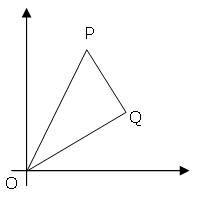

## 91. Right triangles with integer coordinates

The points P (<var>x</var>1, <var>y</var>1) and Q (<var>x</var>2, <var>y</var>2) are plotted at integer co-ordinates and are joined to the origin, O(0,0), to form &Delta;OPQ.

  

There are exactly fourteen triangles containing a right angle that can be formed when each co-ordinate lies between 0 and 2 inclusive; that is, 
0 &le; <var>x</var>1, <var>y</var>1, <var>x</var>2, <var>y</var>2 &le; 2.

  

Given that 0 &le; <var>x</var>1, <var>y</var>1, <var>x</var>2, <var>y</var>2 &le; 50, how many right triangles can be formed?
