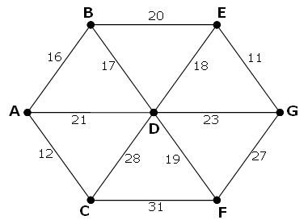

## 107. Minimal network

The following undirected network consists of seven vertices and twelve edges with a total weight of 243.

  

The same network can be represented by the matrix below.

<table align="center">
  <tbody>
    <tr>
      <th>&nbsp;</th>
      <th>A</th>
      <th>B</th>
      <th>C</th>
      <th>D</th>
      <th>E</th>
      <th>F</th>
      <th>G</th>
    </tr>
    <tr>
      <td><strong>A</strong></td>
      <td>-</td>
      <td>16</td>
      <td>12</td>
      <td>21</td>
      <td>-</td>
      <td>-</td>
      <td>-</td>
    </tr>
    <tr>
      <td><strong>B</strong></td>
      <td>16</td>
      <td>-</td>
      <td>-</td>
      <td>17</td>
      <td>20</td>
      <td>-</td>
      <td>-</td>
    </tr>
    <tr>
      <td><strong>C</strong></td>
      <td>12</td>
      <td>-</td>
      <td>-</td>
      <td>28</td>
      <td>-</td>
      <td>31</td>
      <td>-</td>
    </tr>
    <tr>
      <td><strong>D</strong></td>
      <td>21</td>
      <td>17</td>
      <td>28</td>
      <td>-</td>
      <td>18</td>
      <td>19</td>
      <td>23</td>
    </tr>
    <tr>
      <td><strong>E</strong></td>
      <td>-</td>
      <td>20</td>
      <td>-</td>
      <td>18</td>
      <td>-</td>
      <td>-</td>
      <td>11</td>
    </tr>
    <tr>
      <td><strong>F</strong></td>
      <td>-</td>
      <td>-</td>
      <td>31</td>
      <td>19</td>
      <td>-</td>
      <td>-</td>
      <td>27</td>
    </tr>
    <tr>
      <td><strong>G</strong></td>
      <td>-</td>
      <td>-</td>
      <td>-</td>
      <td>23</td>
      <td>11</td>
      <td>27</td>
      <td>-</td>
    </tr>
  </tbody>
</table>

However, it is possible to optimise the network by removing some edges and still ensure that all points on the network remain connected. The network which achieves the maximum saving is shown below. It has a weight of 93, representing a saving of 243 - 93 = 150 from the original network.

  

Using [network.txt](./network.txt), a 6K text file containing a network with forty vertices, and given in matrix form, find the maximum saving which can be achieved by removing redundant edges whilst ensuring that the network remains connected.
